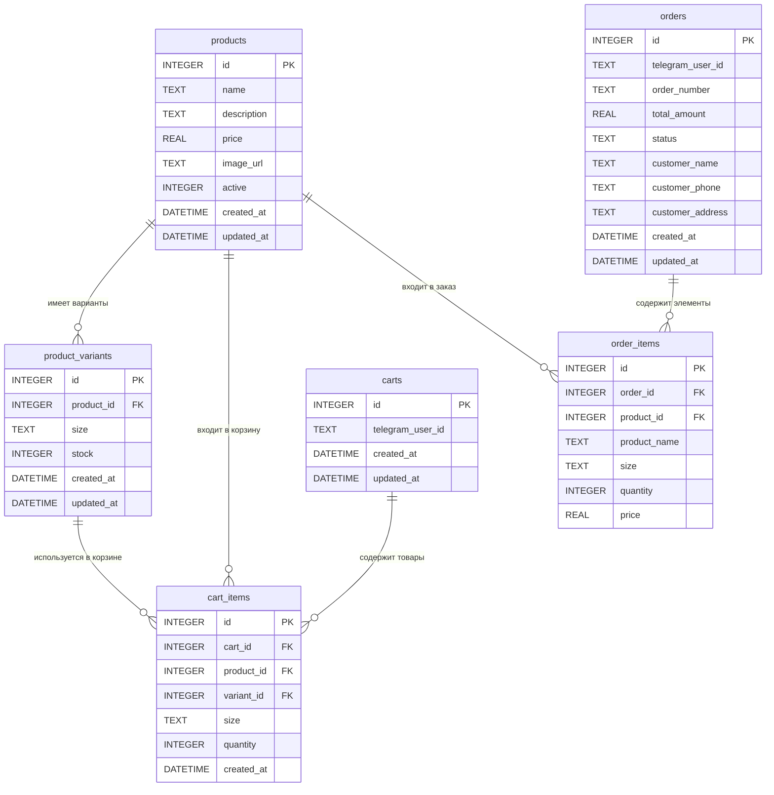

# Диаграмма связей таблиц базы данных

## ER-диаграмма (Entity-Relationship Diagram)



## Объяснение связей (Relationships)

### 1. products → product_variants (один ко многим)
**Связь:** Один товар может иметь много вариантов (размеров)

**Пример:**
- Товар "Футболка Pantera - Черная" (id=1)
- Варианты: S (id=1), M (id=2), L (id=3), XL (id=4)
- Все варианты ссылаются на `product_id = 1`

**FOREIGN KEY:** `product_variants.product_id → products.id`
**ON DELETE CASCADE:** Если удалить товар, все его варианты удалятся автоматически

---

### 2. products → cart_items (один ко многим)
**Связь:** Один товар может быть в нескольких корзинах

**Пример:**
- Товар "Футболка Pantera - Черная" (id=1)
- Может быть в корзине пользователя A и пользователя B
- Каждая запись `cart_items` ссылается на `product_id = 1`

**FOREIGN KEY:** `cart_items.product_id → products.id`

---

### 3. products → order_items (один ко многим)
**Связь:** Один товар может быть в нескольких заказах

**Пример:**
- Товар "Футболка Pantera - Черная" (id=1)
- Может быть в заказе #001, заказе #002 и т.д.
- Каждая запись `order_items` ссылается на `product_id = 1`

**FOREIGN KEY:** `order_items.product_id → products.id`

---

### 4. product_variants → cart_items (один ко многим)
**Связь:** Один вариант товара может быть в нескольких корзинах

**Пример:**
- Вариант "Футболка Pantera - Черная, размер M" (variant_id=2)
- Может быть в корзине пользователя A и пользователя B
- Каждая запись `cart_items` ссылается на `variant_id = 2`

**FOREIGN KEY:** `cart_items.variant_id → product_variants.id`

---

### 5. carts → cart_items (один ко многим)
**Связь:** Одна корзина может содержать много товаров

**Пример:**
- Корзина пользователя (cart_id=1)
- Может содержать: футболка M, футболка L, еще один товар
- Все записи `cart_items` ссылаются на `cart_id = 1`

**FOREIGN KEY:** `cart_items.cart_id → carts.id`
**ON DELETE CASCADE:** Если удалить корзину, все товары из нее удалятся автоматически

**UNIQUE:** `(cart_id, variant_id)` - один вариант товара может быть в корзине только один раз

---

### 6. orders → order_items (один ко многим)
**Связь:** Один заказ может содержать много товаров

**Пример:**
- Заказ #001 (order_id=1)
- Может содержать: футболка M, футболка L, еще один товар
- Все записи `order_items` ссылаются на `order_id = 1`

**FOREIGN KEY:** `order_items.order_id → orders.id`
**ON DELETE CASCADE:** Если удалить заказ, все его элементы удалятся автоматически

---

## Важные моменты

### Почему в cart_items есть и product_id, и variant_id?
- `product_id` - для быстрого доступа к основным данным товара (название, цена, изображение)
- `variant_id` - для точного указания размера и остатка на складе
- `size` - дублируется для удобства (чтобы не делать JOIN каждый раз)

### Почему в order_items нет variant_id?
- В заказах хранится "снимок" (snapshot) данных на момент заказа
- Товар мог измениться или удалиться, но заказ должен сохранить историю
- Поэтому храним `product_name`, `size`, `price` напрямую

### Каскадное удаление (ON DELETE CASCADE)
- Если удалить `product` → автоматически удалятся все `product_variants` этого товара
- Если удалить `cart` → автоматически удалятся все `cart_items` этой корзины
- Если удалить `order` → автоматически удалятся все `order_items` этого заказа

Это защищает от "осиротевших" записей в БД.

---

## Примеры использования связей

### Получить все размеры товара:
```sql
SELECT * FROM product_variants WHERE product_id = 1;
```

### Получить все товары в корзине пользователя:
```sql
SELECT 
  cart_items.*,
  products.name,
  products.price,
  products.image_url
FROM cart_items
JOIN products ON cart_items.product_id = products.id
WHERE cart_items.cart_id = 1;
```

### Получить все элементы заказа:
```sql
SELECT * FROM order_items WHERE order_id = 1;
```

---

## Диаграмма связей

Диаграмма находится в начале этого файла (Mermaid ER-диаграмма). Её можно просмотреть в любом Markdown редакторе с поддержкой Mermaid (VS Code, GitHub, GitLab и т.д.).

